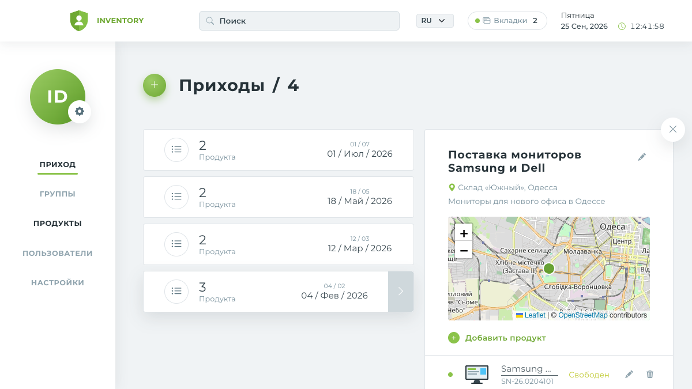
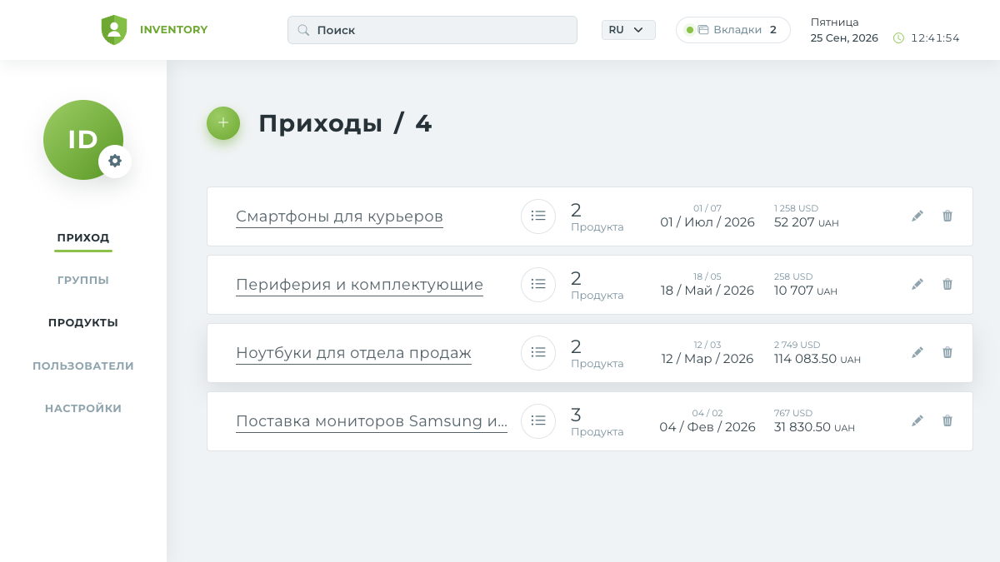
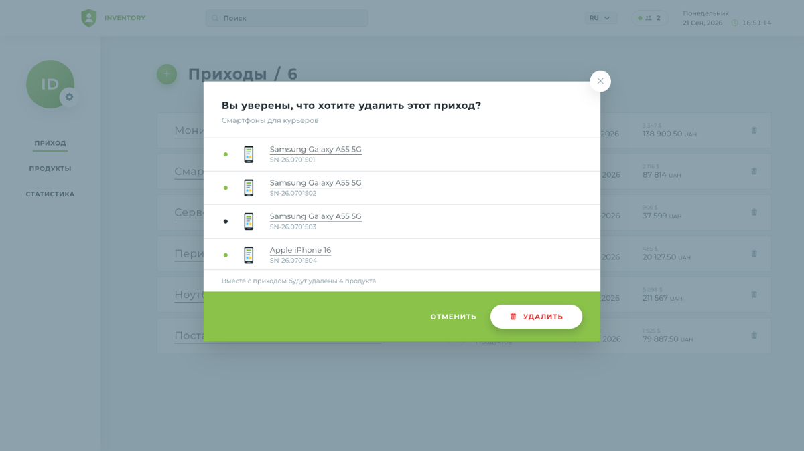
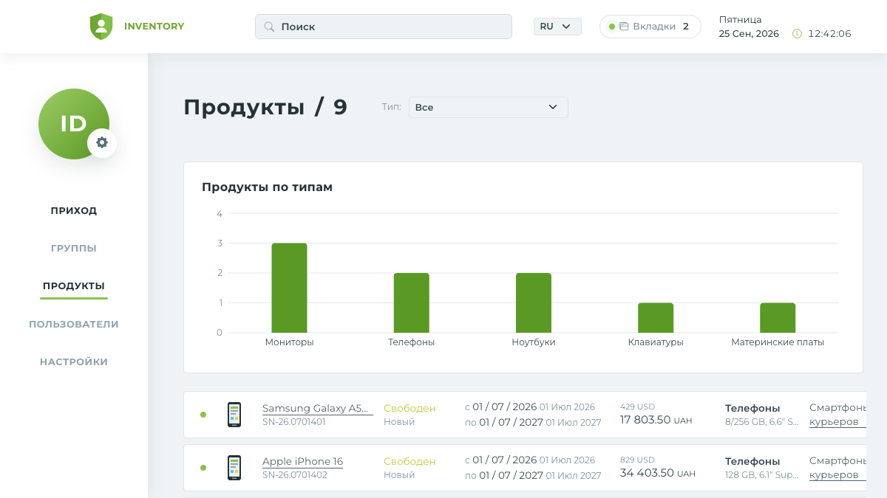
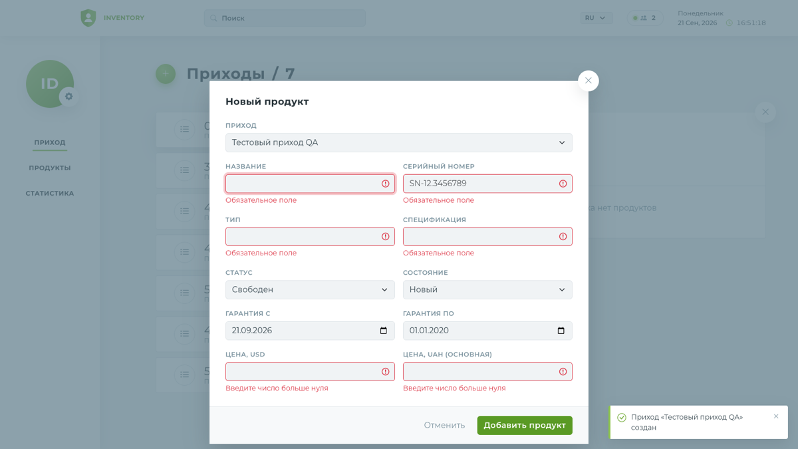
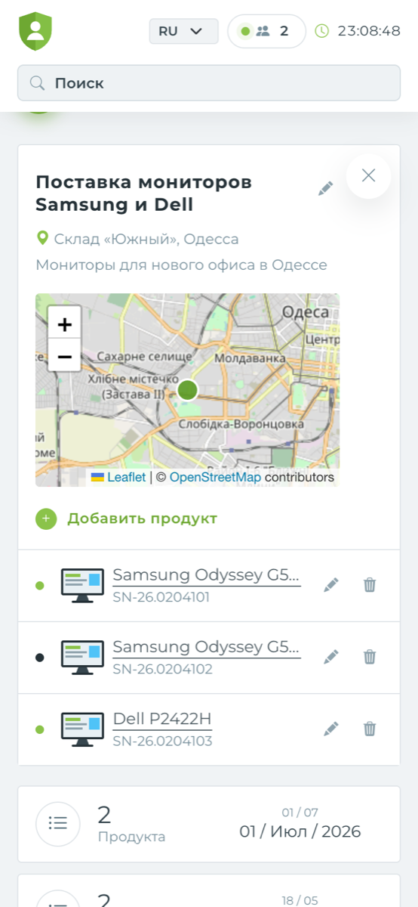
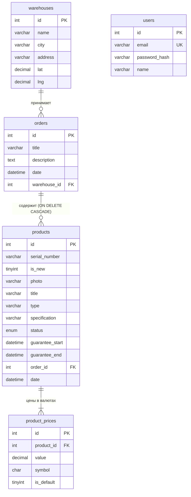

# Inventory — SPA «Orders & Products»

Тестовое задание dZENcode (уровень **Junior+**). SPA для учёта приходов (Orders) и продуктов (Products) на складах: список приходов с раскрывающейся панелью деталей, удаление через попап, каталог продуктов с фильтром по типу, часы и счётчик активных вкладок в реальном времени, график продуктов по типам и карта склада прихода.



**Демо:** https://dzencode-inventory.vercel.app (фронт на Vercel, API + Socket.io + MySQL на Railway)

**Демо-доступ:** `admin@inventory.local` / `Admin123!` (на странице входа есть кнопка «Подставить»).

## Содержание

- [Быстрый старт (Docker)](#быстрый-старт-docker)
- [Функциональность](#функциональность)
- [Соответствие ТЗ](#соответствие-тз)
- [Архитектура и стек](#архитектура-и-стек)
- [Локальная разработка без Docker](#локальная-разработка-без-docker)
- [Тесты и проверки](#тесты-и-проверки)
- [База данных и MySQL Workbench](#база-данных-и-mysql-workbench)
- [REST API и WebSocket](#rest-api-и-websocket)
- [Деплой на VDS](#деплой-на-vds)
- [Git-ветвление](#git-ветвление)

## Быстрый старт (Docker)

Нужны только **Docker** и **Docker Compose v2**.

```bash
git clone <url-репозитория> dzencode-inventory
cd dzencode-inventory
cp .env.example .env        # затем впишите свой JWT_SECRET (например, `openssl rand -hex 32`)
docker compose up -d --build
```

Откройте **http://localhost:8080** и войдите демо-пользователем.

При первом запуске MySQL создаёт схему и демо-данные из `db/schema.sql` и `db/seed.sql`: 4 склада, 4 прихода, 9 продуктов. Первая сборка занимает 2–4 минуты.

| Команда | Что делает |
|---|---|
| `docker compose ps` | статус контейнеров (`db`, `server`, `client`, `nginx`) |
| `docker compose logs -f server` | логи API |
| `docker compose down` | остановить |
| `docker compose down -v` | остановить и **удалить данные БД** (при следующем старте сиды применятся заново) |

Порты меняются в `.env`: `APP_PORT` — приложение (по умолчанию 8080), `DB_PORT` — MySQL для Workbench (по умолчанию 3307, доступен только с `127.0.0.1`).

## Функциональность

**Верхнее меню (TopMenu)**
- Дата, день недели и время, обновляются каждую секунду.
- Счётчик **активных вкладок приложения** через Socket.io (ТЗ п.8): плашка «Вкладки N» рядом с датой. Откройте приложение в нескольких вкладках или браузерах, и число изменится везде сразу. Зелёный индикатор показывает, что соединение есть.
- Поиск по названию прихода, названию и серийному номеру продукта.
- Переключатель языка RU / UA / EN.

**Навигация (Navigation Menu)**
- Пункты как на макете: Приход, Группы, Продукты, Пользователи, Настройки. Рабочие — «Приход» и «Продукты» (ТЗ п.3); остальные разделы в ТЗ не описаны, поэтому показаны неактивными.
- Анимированное подчёркивание активного пункта.
- В профиле (шестерёнка на аватаре) — выход.

**Приходы (Orders)**
- В каждом приходе видно: название, количество продуктов, дату создания в двух форматах (`06 / 04` и `06 / Апр / 2017`), сумму прихода в двух валютах (USD и UAH), кнопку удаления.
- Клик по приходу открывает панель рядом, а список сжимается до компактного вида. Панель закрывается крестиком. В панели:
  - склад и его расположение на карте (Leaflet + OpenStreetMap);
  - описание;
  - продукты прихода;
  - «Добавить продукт».
- Открытый приход сохраняется в URL (`/orders?order=1`): ссылкой можно поделиться, после перезагрузки он откроется снова.
- Кнопка «+» открывает форму создания прихода с валидацией, карандаш — редактирование прихода.
- Удаление через попап по макету. Попап показывает продукты, которые будут удалены вместе с приходом (каскадно).

**Продукты (Products)**
- Все продукты. У каждого: статус, название, серийный номер, гарантия «с … по …» в двух форматах, состояние (новый / Б/У), цена в двух валютах, тип, спецификация, название прихода (ссылка на приход), дата.
- Фильтр по **типу** (один select). Выбранный тип запоминается в `localStorage`.
- Над списком график «Продукты по типам» (Recharts).
- Добавление продукта — из панели прихода («Добавить продукт»), как на макете. Редактирование через форму с валидацией (карандаш в строке). Удаление через тот же попап.
- Фото продукта: одна из встроенных иконок или своё изображение (PNG/JPEG/WEBP/GIF, загрузка на сервер).

**Адаптивность.** Вёрстка работает от 360px до широких экранов:
- на телефоне сайдбар становится горизонтальным меню;
- строки продуктов превращаются в карточки;
- открытый приход показывается над списком.

<details>
<summary>Скриншоты</summary>

| | |
|---|---|
|  |  |
|  | |
|  |  |

</details>

## Соответствие ТЗ

### Обязательные технологии

| Требование | Реализация |
|---|---|
| Глобальное состояние | **Redux Toolkit** — `client/src/store`: слайсы, мемоизированные селекторы, async thunks, listener middleware |
| Компонентный подход | `client/src/components/*` — layout, orders, products, modals, ui |
| Роутинг | Next.js App Router: `/orders`, `/products`, `/login` |
| Анимации | библиотека `motion`: переход между роутами (`app/(dashboard)/template.tsx`), раскрытие прихода (layout-анимации), панели, модалки, удаление строк, подчёркивание меню, счётчики. Учитывается `prefers-reduced-motion` |
| ES6+ | стрелочные функции, spread, деструктуризация, шаблонные строки, модули |
| Git | история с ветками `feature/*`, см. [Git-ветвление](#git-ветвление) |
| WebSocket | **Socket.io**: счётчик активных вкладок (`server/src/realtime.ts`, `client/src/hooks/useRealtime.ts`) |
| HTML/CSS по макетам | SCSS по **БЭМ** (`client/src/styles/blocks/*`, один файл на блок) + **Bootstrap 5** (сетка форм, form-controls, кнопки, утилиты) + Bootstrap Icons |
| REST (Axios/Fetch) | **Axios** на клиенте (`lib/api.ts`), **fetch** при SSR (`lib/serverApi.ts`) |
| Валидация форм | **react-hook-form + zod** на клиенте, **zod** на сервере (ошибки полей возвращаются в ответе 400) |
| Docker | `docker-compose.yml`: MySQL, API, Next.js, nginx |
| Схема БД | модель MySQL Workbench `db/inventory.mwb` + DDL `db/schema.sql`, см. [раздел про БД](#база-данных-и-mysql-workbench) |

### Уровень Junior+

| Требование | Реализация |
|---|---|
| **TypeScript** | весь код клиента и сервера, `strict` |
| **SSR (Next.js)** | Next.js 16. Страницы — серверные компоненты: данные загружаются на сервере с JWT пользователя, HTML приходит уже со списками, затем гидрируются в Redux (`store/StoreHydrator.tsx`) |
| **Unit-тесты** | Vitest + Testing Library: 30 тестов клиента (форматирование, валидация, Redux, компоненты), 28 тестов сервера (API через supertest, счётчик сессий на настоящем Socket.io) |
| **i18n** | `next-intl`, словари `client/messages/{ru,uk,en}.json`, ICU-плюрализация («1 продукт / 2 продукта / 5 продуктов»). Язык хранится в cookie и работает при SSR |
| **JWT** | вход выдаёт JWT в **httpOnly**-cookie (недоступна из JS, защита от XSS). API проверяет подпись и срок, также принимает `Authorization: Bearer`. `proxy.ts` не пускает на страницы без токена |
| **Web Storage** | выбранный тип продуктов сохраняется в `localStorage` через listener middleware Redux (`lib/storage.ts`) |
| **Lazy Loading** | `next/dynamic`: модалки и формы, графики (recharts), карта (leaflet) грузятся отдельными чанками только по требованию; `loading.tsx` на уровне роутов |
| **Charts** | Recharts: график «Продукты по типам» над списком продуктов (`components/products/TypesChart.tsx`) |
| **Maps** | Leaflet + OpenStreetMap: склад прихода на карте в панели деталей (`components/orders/WarehouseMap.tsx`) |

## Архитектура и стек

```
Браузер ──► nginx :8080 ──┬── /            ──► client  (Next.js 16, SSR)  ──┐ SSR-запросы с cookie
                          ├── /api/*       ──► server  (Express 5, REST)  ◄─┘
                          └── /socket.io/* ──► server  (Socket.io)
                                                 │
                                                 └──► db (MySQL 8.4)
```

- **client:** Next.js 16 (App Router), React 19, TypeScript, Redux Toolkit, next-intl, Bootstrap 5 + SCSS (БЭМ), motion, react-hook-form + zod, Axios, socket.io-client, Recharts, react-leaflet, Vitest.
- **server:** Node.js, Express 5, Socket.io 4, mysql2, jsonwebtoken, bcryptjs, zod, helmet, Vitest + supertest. Репозитории передаются в `createApp()` как зависимость, поэтому API тестируется без базы.
- **nginx:** единая точка входа. Фронт, API и WebSocket на одном домене, поэтому не нужны CORS и third-party cookies.

```
.
├── client/                 Next.js-приложение
│   ├── messages/           словари i18n (ru, uk, en)
│   └── src/
│       ├── app/            роуты: (dashboard)/orders|products, login
│       ├── components/     layout, orders, products, modals, ui, auth
│       ├── hooks/          useRealtime (Socket.io), useNow (часы)
│       ├── i18n/           конфиг next-intl
│       ├── lib/            api, serverApi, config, format, validation, storage
│       ├── store/          Redux: slices, selectors, StoreProvider, StoreHydrator
│       ├── styles/         SCSS: abstracts, base, blocks (БЭМ)
│       └── proxy.ts        защита страниц (бывший middleware)
├── server/
│   ├── src/                app, config, http (routes, auth, schemas, errors), db, realtime
│   ├── public/icons/       встроенные иконки продуктов (добавьте файл — появится в форме)
│   └── test/               тесты API и WebSocket
├── db/                     inventory.mwb, schema.sql, seed.sql
├── nginx/nginx.conf
├── docs/screenshots/
└── docker-compose.yml
```

## Настройка через переменные окружения

Всё, что может отличаться между окружениями, задаётся в `.env` (для Docker) или `server/.env` / `client/.env.development` (для разработки). Валюты фиксированы: UAH (основная) и USD, как в `app.js` из ТЗ.

| Переменная | По умолчанию | Что настраивает |
|---|---|---|
| `UPLOAD_MAX_MB` | `2` | максимальный размер загружаемого фото |
| `ICONS_DIR` | `server/public/icons` | папка встроенных иконок. Любой файл SVG/PNG/JPEG/WEBP из неё доступен в форме продукта |
| `DEFAULT_PRODUCT_PHOTO` | `/icons/default.svg` | фото продукта, если оно не выбрано |
| `UPLOAD_DIR` | `server/uploads` | куда сохраняются загруженные фото (в Docker — отдельный volume) |
| `AUTH_COOKIE_NAME` | `token` | имя cookie с JWT (одинаковое для API и клиента) |
| `JWT_SECRET`, `JWT_TTL_SECONDS` | — / 8 часов | подпись и срок жизни токена |
| `DEMO_EMAIL`, `DEMO_PASSWORD` | пусто | демо-доступ на странице входа; если не заданы, подсказка скрыта |
| `DEFAULT_LOCALE`, `TIME_ZONE` | `ru`, `Europe/Kyiv` | язык по умолчанию и часовой пояс |
| `NEXT_PUBLIC_MAP_TILE_URL`, `NEXT_PUBLIC_MAP_ATTRIBUTION` | OpenStreetMap | сервер тайлов карты |

Типы продуктов не зашиты в код: это данные, которые вводит пользователь (в форме есть подсказки из уже существующих типов). Названия месяцев берутся из встроенной локализации (`Intl`).

## Локальная разработка без Docker

Нужен Node.js 20+ (проверено на 24 и 26). MySQL удобнее всего поднять из compose.

```bash
npm run install:all            # зависимости server и client
cp .env.example .env           # для docker compose
npm run dev:db                 # только MySQL на 127.0.0.1:3307
cp server/.env.example server/.env
npm run dev:server             # API + Socket.io на http://localhost:4000
npm run dev:client             # в другом терминале: Next.js на http://localhost:3000
```

В dev-режиме Next.js проксирует `/api/*` на `localhost:4000` (rewrites), а Socket.io подключается к `NEXT_PUBLIC_WS_URL` из `client/.env.development`.

## Тесты и проверки

```bash
npm test             # unit-тесты server + client
npm run typecheck    # tsc --noEmit для обеих частей
npm run lint         # ESLint (eslint-config-next)
npm run check        # всё вместе
```

## База данных и MySQL Workbench

Модель MySQL Workbench: `db/inventory.mwb` (EER-диаграмма). Та же схема в виде DDL MySQL 8: `db/schema.sql`. Демо-данные: `db/seed.sql`.



Цены вынесены в отдельную таблицу `product_prices`, как массив `price` в `app.js`. Так поддерживается любое число валют, а одна из них помечается как основная (`is_default`).

**Как открыть в MySQL Workbench:**
1. ER-диаграмма: `File → Open Model…` → `db/inventory.mwb`.
2. Живая база из Docker: новое подключение `127.0.0.1:3307`, пользователь `inventory` / `inventory`, схема `inventory`.

## REST API и WebSocket

Все эндпоинты, кроме `/api/health` и `/api/auth/login`, требуют JWT (cookie `token` или `Authorization: Bearer <jwt>`).

| Метод | Путь | Описание |
|---|---|---|
| `GET` | `/api/health` | проверка работоспособности |
| `POST` | `/api/auth/login` | `{ email, password }` → устанавливает httpOnly-cookie с JWT, возвращает `{ user }` |
| `POST` | `/api/auth/logout` | удаляет cookie |
| `GET` | `/api/auth/me` | текущий пользователь |
| `GET` | `/api/orders` | список приходов |
| `POST` | `/api/orders` | создать: `{ title, description?, date, warehouseId? }` |
| `DELETE` | `/api/orders/:id` | удалить приход вместе с его продуктами |
| `GET` | `/api/products?type=&orderId=` | список продуктов (формат как в `app.js`: `guarantee`, `price[]`, `order`) |
| `POST` | `/api/products` | создать продукт |
| `DELETE` | `/api/products/:id` | удалить продукт |
| `PUT` | `/api/orders/:id` | изменить приход |
| `PUT` | `/api/products/:id` | изменить продукт (включая фото и цены) |
| `GET` | `/api/warehouses` | склады с координатами |
| `GET` | `/api/settings` | валюты (UAH, USD, как в `app.js`) и основная валюта |
| `GET` | `/api/icons` | встроенные иконки продуктов |
| `POST` | `/api/uploads` | загрузить фото (`multipart/form-data`, поле `file`) → `{ url }` |

Ошибки валидации приходят как `400 { message, errors: [{ path, message }] }`.

**Socket.io:** каждая открытая вкладка держит одно соединение. При подключении и отключении сервер рассылает всем событие `sessions:count` с числом активных вкладок.

## Деплой на VDS

Подойдёт любой VDS с Ubuntu 22.04+ и 1 ГБ RAM.

```bash
# 1. Docker
curl -fsSL https://get.docker.com | sh

# 2. Проект
git clone <url-репозитория> /opt/inventory && cd /opt/inventory
cp .env.example .env
#   JWT_SECRET=<openssl rand -hex 32>
#   APP_PORT=80
#   PUBLIC_URL=http://<ip-или-домен>
docker compose up -d --build
```

Для HTTPS поставьте перед приложением обратный прокси с сертификатом, например Caddy (`reverse_proxy localhost:8080`) или nginx + certbot. Затем в `.env` укажите `PUBLIC_URL=https://домен` и `COOKIE_SECURE=true` и выполните `docker compose up -d`.

## Git-ветвление

Работа велась по упрощённому git-flow:
- `main` — стабильная версия;
- `develop` — интеграционная ветка;
- `feature/*` — отдельные задачи: схема БД, API, realtime, клиентская основа, страницы Orders и Products, модалки и формы, i18n, графики и карта, Docker, документация.

Каждая фича вливается в `develop` через merge-коммит (`--no-ff`), поэтому ветки видны в истории (`git log --graph`). Релиз — merge `develop` → `main`.
